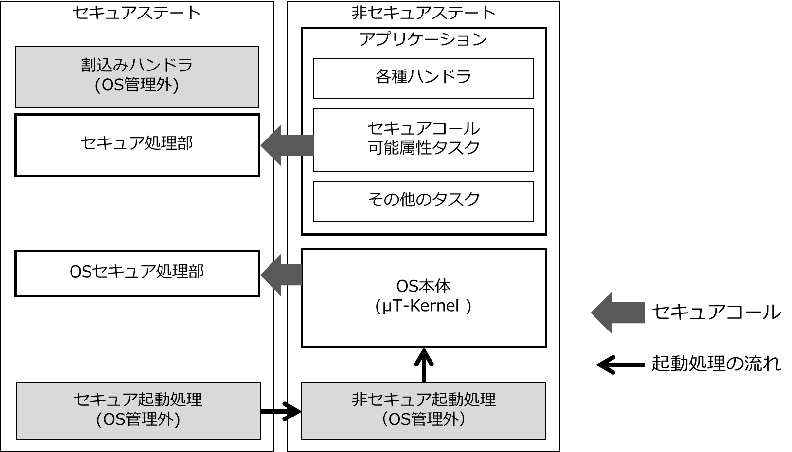

# μT-Kernel 3.0 セキュア機能拡張 機能仕様書 <!-- omit in toc -->
## Version 1.00.B0 <!-- omit in toc -->
## 2025.11.14 <!-- omit in toc -->

- [1. 概要](#1-概要)
  - [1.1. 本書の目的](#11-本書の目的)
  - [1.2. セキュア機能拡張とは](#12-セキュア機能拡張とは)
  - [1.3. 参考文献](#13-参考文献)
- [2. 本OSの動作モデル](#2-本osの動作モデル)
  - [2.1. 動作モデルの種類](#21-動作モデルの種類)
  - [2.2. 動作モデルの指定](#22-動作モデルの指定)
  - [2.3. コンフィギュレーションの組み合わせと動作モデル](#23-コンフィギュレーションの組み合わせと動作モデル)
- [3. 標準実行モデル](#3-標準実行モデル)
  - [3.1. 標準実行モデルの基本仕様](#31-標準実行モデルの基本仕様)
  - [3.2. セキュアコール可能属性のタスク](#32-セキュアコール可能属性のタスク)
    - [3.2.1. タスクからのセキュアコール](#321-タスクからのセキュアコール)
    - [3.2.2. タスクのセキュアスタック](#322-タスクのセキュアスタック)
    - [3.2.3. タスクの生成](#323-タスクの生成)
    - [3.2.4. タスクの削除](#324-タスクの削除)
  - [3.3. OSの起動処理](#33-osの起動処理)
  - [3.4. セキュアステートのOS処理](#34-セキュアステートのos処理)
- [4. 非セキュア実行モデル](#4-非セキュア実行モデル)
  - [4.1. 非セキュア実行モデルの基本仕様](#41-非セキュア実行モデルの基本仕様)
  - [4.2. セキュアコールが可能な条件](#42-セキュアコールが可能な条件)
- [5. 変更履歴](#5-変更履歴)

# 1. 概要
## 1.1. 本書の目的
本書はμT-Kernel 3.0のセキュア機能拡張の機能仕様を記す。

## 1.2. セキュア機能拡張とは
セキュア機能拡張は、μT-Kernel 3.0に対してArm v8-MアーキテクチャのTrustZone機能に対応したOSの機能を拡張するソフトウェアである。
セキュア機能拡張はμT-Kernel 3.0に組み込まれ、その一部として動作する。セキュア機能拡張を組み込んだμT-Kernel 3.0をセキュア機能拡張対応μT-Kernel 3.0と呼ぶ。
以降、本OSと称した場合は、セキュア機能拡張対応μT-Kernel 3.0を示す。

## 1.3. 参考文献
μT-Kernel 3.0 仕様書  
<https://tron-forum.github.io/mtk3_spec_jp/index.html>

Arm Cortex-M用TrustZone  
<https://www.arm.com/ja/technologies/trustzone-for-cortex-m>

# 2. 本OSの動作モデル
## 2.1. 動作モデルの種類

本OSは以下の3つの作モデルを持つ。動作モデルは本OSのビルド時にコンフィギュレーションにていずれかを指定される。動作モデルはビルド時に静的に決定されるので、実行時に変更することはできない。

\(1\) 標準実行モデル  
本実行モデルでは、本OSおよびそのアプリケーションは、TrustZoneの非セキュアステートにて動作する。  
アプリケーションの特定の属性のタスク（セキュア呼び出し可能属性のタスク）からは、セキュアコールにより、セキュアステートのプログラムを呼び出して実行することができる。その際には、セキュア、非セキュア共に実行コンテキストの管理を行う。  
本実行モデルはPlatform Security Architecture (PSA)に準拠し、本OSの標準的な実行モデルである。  
詳細は「3. 標準実行モデル」を参照のこと。  

\(2\) セキュア実行モデル  
本実行モデルでは、本OSおよびそのアプリケーションは、TrustZoneのセキュアステートにて動作する。非セキュアステートに関する制御は行わない。  
本実行モデルは、TrustZoneが有効となっているマイコンにおいて、非セキュアステートを使用せず、セキュアステートのみでプログラムを実行する場合を想定している。機能、動作は通常のμT-Kernel 3.0と同じである。  

\(3\) 非セキュア実行モデル  
本実行モデルでは、本OSおよびそのアプリケーションは、TrustZoneの非セキュアステートにて動作する。セキュアステートに関する制御は行わない。  
アプリケーションのタスクからは、セキュアコールにより、セキュアステートのプログラムを呼び出す場合は、本OSからは何の制御もおこなわないため、セキュアステートのプログラム実行中のタスクのディスパッチに関して、アプリケーション側で対応が必要となる。  
詳細は「4.非セキュア実行モデル」を参照のこと。

## 2.2. 動作モデルの指定
本OSは、にコンフィギュレーションの設定により動作モデルを指定する。  
コンフィギュレーションの設定は、コンフィギュレーション・ファイルconfig_sec.hにて記述する。  
具体的なコンフィギュレーション・ファイルの所在は、各マイコンへの実装仕様書に記載する。  

コンフィギュレーションの項目一覧と値を以下の表に示す。  

| 項目            | 名称            | 機能                                                  |
| ------------- | ------------- | --------------------------------------------------- |
| TrustZone対応機能 | CNF_TZ_ENABLE | 
1：TrustZone対応機能は有効

0: TrustZone対応機能は無効
 |
| OSの実行ステート     | CNF_TZ_STATE  | 
1: セキュアステートで実行

0: 非セキュアステートで実行
         |
| タスクのセキュアコール   | CNF_TZ_SCALL  | 
1: タスクのセキュアコール可能

0: タスクのセキュアコール不可
      |

各コンフィギュレーション項目について説明する。

1)  TrustZone対応機能 CNF_TZ_ENABLE  
本OSのTrustZone対応機能を有効とするか否かを設定する。  
値0とした場合、本OSのTrustZone対応機能はすべて無効となる。この場合、本OSは通常のμT-Kerne3.0と同等の機能、動作となる。他のコンフィギュレーションの設定は無視される。

2)  OSの実行ステート CNF_TZ_STATE  
本OSが実行されるTrustZoneの実行ステートを指定する。  
また本OSと本OSのアプリケーションは同じ実行ステートで実行される。  
本設定はTrustZone対応機能が有効の場合(CNF_TZ_ENABLE = 1)のみ有効であり、それ以外は無視る。

3)  タスクのセキュアコール CNF_TZ_SCALL  
非セキュアで実行中のアプリケーションのタスクからのセキュアコールを可能とするか否かを設定する。

本設定は、アプリケーションが非セキュアで実行される場合(CNF_TZ_ENABLE = 1 かつCNF_TZ_STATE = 0 )のみ有効であり、それ以外は無視される。  
値1とした場合、タスクのセキュアコールは可能となり、セキュアコール可能属性のタスクを生成することができる。  
値0とした場合、タスクのセキュアコールは不可とし、セキュアコール可能属性のタスクを生成することができない。

## 2.3. コンフィギュレーションの組み合わせと動作モデル
本OSの実行モデルは、コンフィギュレーションのCNF_TZ_STATEとCNF_TZ_SCALLの組み合わせで決定される。  
コンフィギュレーションの設定と実行モデルの関係を以下の表に記す。  

|                  | CNF_TZ_SCALL = 0     | CNF_TZ_SCALL = 1 |
|:-----------------|:---------------------|:-----------------|
| CNF_TZ_STATE = 0 | 非セキュア実行モデル | 標準実行モデル   |
| CNF_TZ_STATE = 1 | セキュア実行モデル   |                  |

# 3. 標準実行モデル
## 3.1. 標準実行モデルの基本仕様
標準実行モデルの基本仕様を以下に示す。  

- 本OSは基本的に非セキュアステートで実行される。ただし、OSの一部分はセキュアステートで実行される(「3.4 セキュアステートのOS処理」参照)。

- 本OSの起動処理は、マイコンのブートシーケンスにおいて、非セキュアの起動プログラムから実行される（「3.3 OSの起動処理」参照）。

- セキュアステートで実行されるプログラムは、その実行モードに関わらず、全て本OSのAPIは呼び出しを禁止する。セキュアステートから本OSのAPIが呼び出された場合の動作は保証しない。

- 本OSで実行されるアプリケーション（タスクおよびハンドラ）は非セキュアステートで実行される。ただし、セキュアコール可能属性のタスクのみセキュアコールが可能である（「3.2 セキュアコール可能属性のタスク」参照）。

- 本OSで実行されるアプリケーション（タスクおよびハンドラ）は非セキュアステートで実行されている限り、通常のμT-Kernel 3.0と機能、動作は同じである。  

以下の標準実行モデルのソフトウェア構成の概略を示す。

図1 　標準実行モデルのソフトウェア構成の概略

## 3.2. セキュアコール可能属性のタスク
セキュアコール可能属性のタスクの基本仕様を以下に示す。

### 3.2.1. タスクからのセキュアコール
セキュアコール可能属性のタスクは、実行中にセキュアコールが可能である。それ以外は他のタスクと基本的に機能は同じである。  
タスクから呼び出されたセキュアコールは、タスクの実行コンテキストとみなされる。つまりOSからはそのタスクの実行中とみなされる。  
ただし、タスクから呼び出されたセキュアコールであっても、本OSのAPIを使用することはできない。セキュアステートから本OSのAPIが呼び出された場合の動作は保証しない。  
タスクから呼び出されたセキュアコールの実行中であっても、タスクのディスパッチは必要に応じて実行され、システムのリアルタイム性を損なうことはない。  
ディスパッチは以下の場合に行われる。  

- OSの時間処理（チックタイム処理）により、タスクの実行優先順位が変化し、より優先順位の高いタスクが実行可能な状態となった場合

- 非セキュア割込みが発生し、その割込みハンドラにおける本OSのAPI呼び出しにより、タスクの実行優先順位が変化し、より優先順位の高いタスクが実行可能な状態となった場合

### 3.2.2. タスクのセキュアスタック
セキュアコール可能属性のタスクのセキュアスタックは、セキュアステート用のスタックを持つ。  
本スタックは、セキュアコール可能属性のタスクの生成時にサイズが指定され、OSがタスクを制裁する際に、セキュアステートのシステムメモリ領域から確保する。  
本スタックは、タスクの実行中にセキュアステートでプログラムが実行された際に使用される。具体的には以下の場合に使用が考えられる。  

- タスクからのセキュアコールの実行
- タスクからの内部でセキュアコールを使用するAPIの実行（tk_cre_tsk、tk_del_tsk、tk_exd_tsk）

- タスク実行中のOSの時間処理（チックタイム処理）によるディスパッチ処理

- タスク実行中のセキュアステートの割込み

### 3.2.3. タスクの生成

セキュアコール属性のタスクは、他のセキュア属性のタスクからのタスク生成API（tk_cre_tsk）により生成される。

セキュア属性のタスク以外からは、セキュアコール属性のタスクを生成することはできない。もし、セキュア属性のタスク以外からは、セキュアコール属性のタスクを生成しようとすればタスク生成APIはエラーE_CTXを返す。

OSが標準実行モデルではない場合は、セキュアコール属性のタスクを生成しようとすればタスク生成APIはエラーE_RSATRを返す。

セキュアコール属性のタスクは、そのタスク生成情報に以下の情報を指定する。それ以外は通常のタスクと同じである。

| タスク生成情報              | 説明                              |
| -------------------- | ------------------------------- |
| タスク属性 tslatr         | セキュアコール可能属性TA_TZCALLを指定する       |
| セキュアスタック・サイズ tzstksz | タスクのセキュアスレートで使用するスタックのサイズを指定する。 |

本件に派生し、本OSは標準実行モデルでは、初期タスクの属性にセキュアコール可能属性TA_TZCALLが設定される。  

### 3.2.4. タスクの削除
セキュアコール属性のタスクは、他のセキュアコール属性のタスクからのタスク削除API（tk_del_tsk）により削除される。または、次タスクからのタスク終了・削除API(tk_exd_stk)で削除される。  
セキュア属性のタスク以外からは、セキュアコール属性のタスクを削除することはできない。もし、セキュア属性のタスク以外からは、セキュアコール属性のタスクを削除しようとすればタスク生成APIはエラーE_CTXを返す。  

## 3.3. OSの起動処理
本OSは非セキュアのプログラム上から、OS起動関数knl_start_kernelを実行することにより起動する。  
マイコンのリセット後からの起動処理の流れは以下となる。  

1)  セキュアステートの起動処理
マイコンのリセット後にセキュアステートの起動処理が実行される。本処理では、必要なハードウェアの初期化やTrustZoneの各種設定を行ったのち、非セキュアステートの起動処理を実行する。具体的な内容は、マイコンやその他のハードウェアとユーザの製品仕様により決定される。  
本処理はOSの起動前の処理であり管理外とする。  

2)  非セキュアステートの起動処理
非セキュアステートで必要なハードウェアの初期化などを実行したのち、OSの起動処理を実行する。具体的な内容は、マイコンやその他のハードウェアとユーザの製品仕様により決定される。  
本処理はOSの起動前の処理であり管理外とする。  

3)  OSの起動処理  
OSを起動したのち、初期タスクを生成、実行する。初期タスクからはアプリケーションの実行関数usermainが呼び出される。この処理は基本的に通常のμT-Kernelと同じである。  

OSの起動にあたっては、以下が正しく行われていなければならない。  

- 非セキュアにおいてC言語のプログラムを実行するために必要な初期化  
  具体的には、コードやデータなどの各セクションのメモリ上への展開、変数の必要な初期化などがある。

- 必要なTrustZone関連の設定  
  本OSおよびアプリケーションから使用されるハードウェアは、非セキュアにて使用可能に設定されていなければならない。本処理はセキュアステートの起動処理で行わなければならない。

非セキュアのハードウェアの初期化は以下のタイミングで行うことができる。これは通常のμT-Kernel 3.0と同様である。

- OS起動前の非セキュアの起動処理

- OSのハードウェア初期化処理

- デバイスドライバの初期化処理

- アプリケーション内の処理

## 3.4. セキュアステートのOS処理
本OSは基本的には非セキュアステートで実行されるが、一部の機能はセキュアステートで実行される。これらの機能は、非セキュアステートで実行される本OSの処理から、セキュアコールとして呼び出される。これをカーネル・セキュアコールと呼ぶ。  
カーネル・セキュアコールにより、以下の機能がセキュアステートで実行される。  

- セキュアスタックの初期化
本OSがセキュアステートで使用するスタックの動的メモリ管理の初期化を行う。  
本機能はOS起動時に１回のみ実行される。  
なお、この動的メモリ管理はごく簡単なものが標準で提供されるが、ユーザは必要に応じて独自のメモリ管理と置き換えが可能とする。  

- セキュアスタックの確保  
  セキュアコール可能タスクを生成する際に、そのタスクが使用するセキュアステートのスタックのメモリ領域を確保する。  
  本機能は、セキュアコール可能タスクの生成時(tk_cre_tsk)に実行される。

- セキュアスタックの解放
セキュアコール可能タスクを削除する際に、そのタスクが使用していたセキュアステートのスタックのメモリ領域を解放する。  
本機能は、セキュアコール可能タスクの削除時(tk_del_tsk またはtl_exd_tsk)に実行される。  

- セキュアステートのコンテキスト切り替え
セキュアコール可能タスクのディスパッチ時に、セキュアステートのコンテキスト切り替えを行う。  
本機能は、タスクのディスパッチの際に、セキュアコール可能タスクがその対象に含まれていた場合に実行される。  

具体的なカーネル・セキュアコールは、ハードウェアに依存した実装仕様とする。各マイコンの実装仕様書を参照のこと。  

# 4. 非セキュア実行モデル
## 4.1. 非セキュア実行モデルの基本仕様

非セキュア実行モデルの基本仕様を以下に示す。  

- 本OSは非セキュアステートのみで実行される。

- セキュアステートで実行されるプログラムは、その実行モードに関わらず、全て本OSのAPIは呼び出しを禁止する。セキュアステートから本OSのAPIが呼び出された場合の動作は保証しない。

- 本OSで実行されるアプリケーション（タスクおよびハンドラ）は非セキュアステートで実行される。ただし、タスクはセキュアコール中にディスパッチが生じない条件でセキュアコールが可能である（「4.2 セキュアコールが可能な条件」参照）。

- 本OSで実行されるアプリケーション（タスクおよびハンドラ）は非セキュアステートで実行されている限り、通常のμT-Kernel 3.0と機能、動作は同じである。

## 4.2. セキュアコールが可能な条件
タスクからのセキュアコールは、他のタスクからのセキュアコールと排他的に実行される限りにおいて、実行することができる。  
具体的には以下の場合が考えられる。  

- タスクからのセキュアコールは、セマフォなどを用いてタスク間で排他的に実行する。

- タスクからセキュアコールを実行している間は、ディスパッチ禁止または割込み禁止とする。

- セキュアコールを行うすべてのタスクの優先度を同一とする。同一の優先度のタスク間では、本OSのAPIを使用しない限り、ディスパッチが行われることはない。セキュアコール実行中はAPIの使用は不可なのでディスパッチは行われない。ただし、他の優先度のタスクまたはハンドラからの以下の操作でもディスパッチは発生するので、これは禁止しなければならない。

  - 他の優先度のタスクまたはハンドラからのタスクの強制待ち(tk_sus_tsk)およびその解除

  - 他の優先度のタスクまたはハンドラからのタスクの優先順位の回転(tk_rot_rdq)

# 5. 変更履歴

| 版数      | 日付         | 内容   |
| ------- | ---------- | ---- |
| 1.00.B1 | 2025.11.14 | 初版 |
